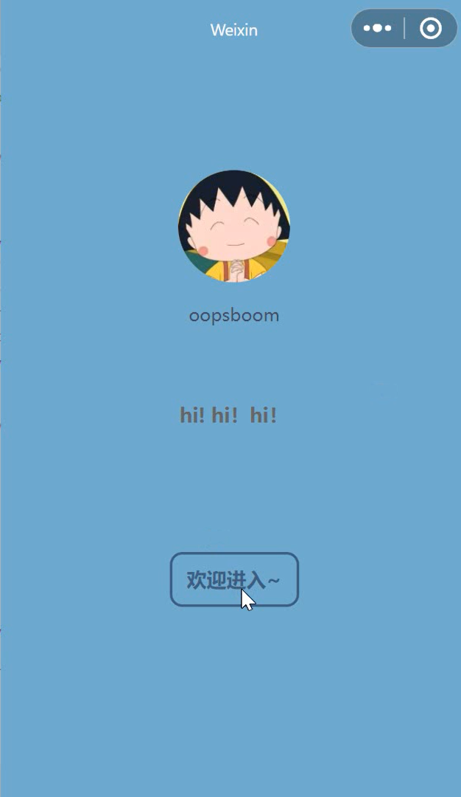
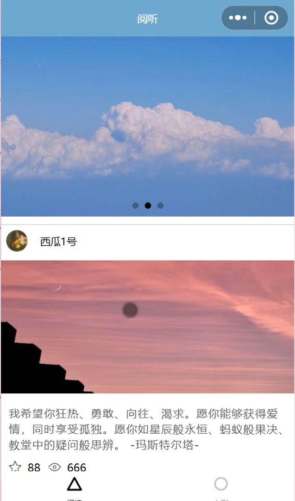
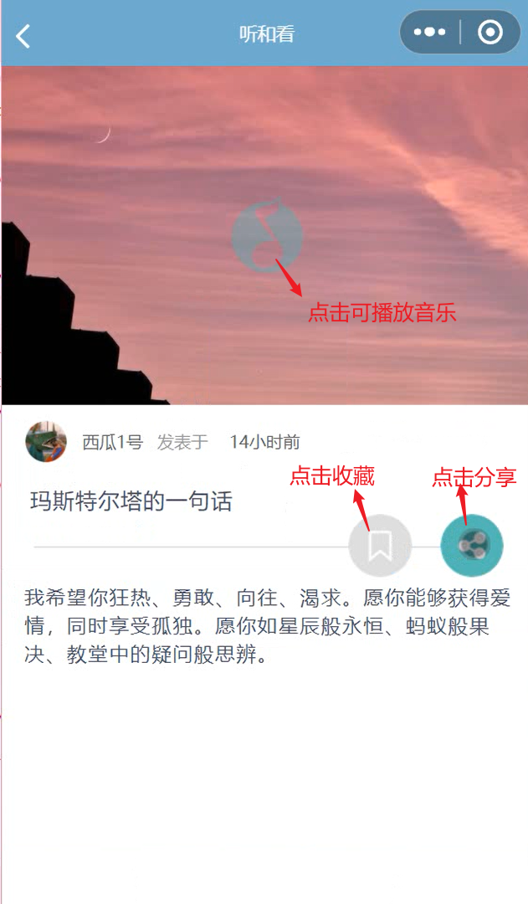
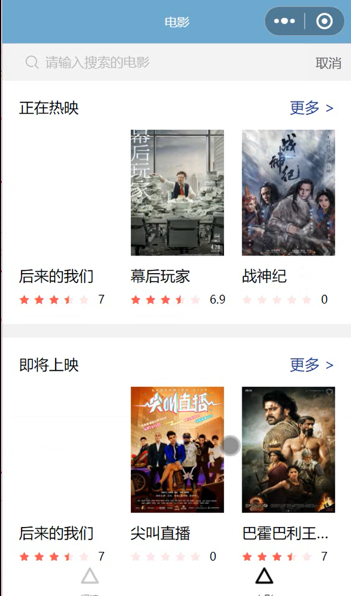
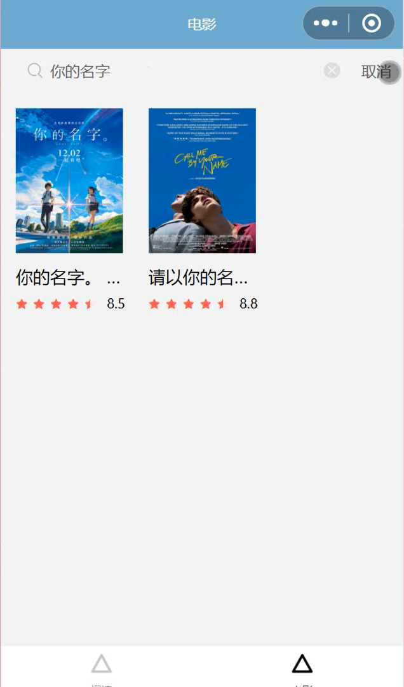

# read_listen
## 介绍

一个集浏览文章、听音乐和电影展示为一体的小程序

采用原生开发。使用LinUI的部分组件和小程序原生组件。

文章页面采用mock数据，电影列表展示及详情页面采用服务器请求数据。

## 运行页面

欢迎页面            |  文章列表页面
:-------------------------:|:-------------------------:
   |  

文章详情页面           | 电影页面
:-------------------------:|:-------------------------:
   | 
 
电影详情页面		             |  电影搜索页面
:-------------------------:|:-------------------------:
  | 
